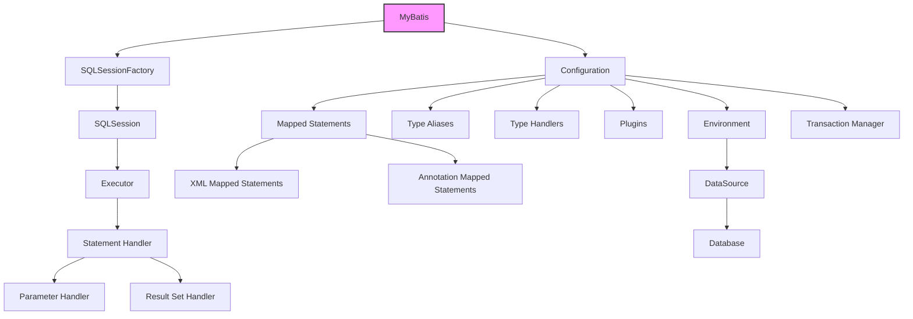

## 什么是MyBatis

MyBatis是一款优秀的持久层框架，主要用于简化Java应用程序与关系数据库之间的操作。它通过使用XML或注解的方式将SQL语句、存储过程和Java方法进行绑定，从而避免了手写大量的JDBC代码和手动设置参数与结果集。

MyBatis支持复杂的SQL查询、动态SQL和高级映射，使得开发者可以更灵活地操作数据库，同时保持代码的清晰和可维护性。

## MyBatis的整体架构




mybatis框架结构2

## MyBatis的核心组件

1. **SqlSessionFactory**
    
    - **定义**：`SqlSessionFactory`是MyBatis的核心接口之一，负责创建`SqlSession`对象。
    - **创建和使用**：通过加载MyBatis配置文件（如`mybatis-config.xml`）并调用`SqlSessionFactoryBuilder`来创建`SqlSessionFactory`实例。`SqlSessionFactory`是线程安全的，可以在应用程序启动时创建一次，之后可以被共享使用。
2. **SqlSession**
    
    - **定义**：`SqlSession`是执行SQL语句的主要接口，它提供了在数据库中执行CRUD操作的方法。
    - **生命周期和作用**：每次数据库操作都需要获取一个新的`SqlSession`实例，操作完成后需要关闭以释放资源。`SqlSession`不是线程安全的，不能在线程之间共享。
3. **Mapper接口**
    
    - **定义**：Mapper接口是MyBatis中的一个核心概念，通过定义接口方法并使用注解或XML配置映射SQL语句，实现Java方法与SQL语句的绑定。
    - **动态代理机制**：MyBatis在运行时会为Mapper接口生成动态代理对象，从而在调用接口方法时执行对应的SQL语句。
4. **Executor**
    
    - **执行器类型**：`Executor`负责SQL语句的执行和结果集的处理。MyBatis提供了三种类型的执行器：`SimpleExecutor`、`ReuseExecutor`和`BatchExecutor`，分别对应简单执行、预处理语句复用和批处理执行。
    - **工作机制**：`Executor`通过`StatementHandler`创建并执行SQL语句，并通过`ResultSetHandler`处理结果集。
5. **Configuration**
    
    - **配置文件解析**：`Configuration`类包含了所有的MyBatis配置信息，如数据源、事务管理、映射器等。
    - **全局配置参数**：`Configuration`从主配置文件（如`mybatis-config.xml`）和映射文件中加载全局配置，管理MyBatis的各种设置和资源。

  
## MyBatis的配置文件

MyBatis的配置文件主要包括主配置文件（`mybatis-config.xml`）和映射文件（Mapper XML文件）。

### 主配置文件（mybatis-config.xml）

`mybatis-config.xml`是MyBatis的核心配置文件，定义了数据库连接信息、事务管理、全局配置参数等。

**环境配置（environments）**
- **作用**：定义不同的运行环境（如开发、测试、生产）及其对应的数据源和事务管理器。
- **示例**：
```xml
<environments default="development">
  <environment id="development">
    <transactionManager type="JDBC"/>
    <dataSource type="POOLED">
      <property name="driver" value="com.mysql.cj.jdbc.Driver"/>
      <property name="url" value="jdbc:mysql://localhost:3306/mydb"/>
      <property name="username" value="root"/>
      <property name="password" value="password"/>
    </dataSource>
  </environment>
</environments>
```
	
**数据源配置（dataSource）**
- **作用**：配置数据库连接池，MyBatis支持三种数据源类型：`UNPOOLED`、`POOLED`和`JNDI`。
- **示例**：
```xml
<dataSource type="POOLED">
  <property name="driver" value="com.mysql.cj.jdbc.Driver"/>
  <property name="url" value="jdbc:mysql://localhost:3306/mydb"/>
  <property name="username" value="root"/>
  <property name="password" value="password"/>
</dataSource>
```
        
**事务管理（transactionManager）**
- **作用**：配置事务管理器类型，支持`JDBC`和`MANAGED`两种类型。
- **示例**：
```xml
<transactionManager type="JDBC"/>
```
**Mapper配置（mappers）**
- **作用**：指定Mapper接口对应的XML映射文件或直接指定Mapper接口类。
- **示例**：
```xml
<mappers>
  <mapper resource="org/mybatis/example/BlogMapper.xml"/>
  <mapper class="org.mybatis.example.BlogMapper"/>
</mappers>
```

### 映射文件（Mapper XML文件）

映射文件用于定义SQL语句及其与Java方法的映射关系。每个Mapper接口通常对应一个XML映射文件。

**命名空间（namespace）**
- **作用**：定义Mapper接口的全限定名，确保SQL语句的唯一性。
- **示例**：
```xml
<mapper namespace="org.mybatis.example.BlogMapper">
```
        
**SQL映射语句（select、insert、update、delete）**
- **作用**：定义SQL语句及其与Java方法的映射关系。
- **示例**：
```xml
<select id="selectBlog" resultType="org.mybatis.example.Blog">
  SELECT * FROM Blog WHERE id = #{id}
</select>

<insert id="insertBlog" parameterType="org.mybatis.example.Blog">
  INSERT INTO Blog (title, content) VALUES (#{title}, #{content})
</insert>

<update id="updateBlog" parameterType="org.mybatis.example.Blog">
  UPDATE Blog SET title = #{title}, content = #{content} WHERE id = #{id}
</update>

<delete id="deleteBlog" parameterType="int">
  DELETE FROM Blog WHERE id = #{id}
</delete>
```
        
**参数类型和返回类型**
- **作用**：指定SQL语句的参数类型和返回结果类型。
- **示例**：
```xml
<select id="selectBlog" parameterType="int" resultType="org.mybatis.example.Blog">
  SELECT * FROM Blog WHERE id = #{id}
</select>
```

## MyBatis的工作流程
MyBatis的工作流程包括配置文件加载、`SqlSessionFactory`创建、`SqlSession`获取、Mapper方法调用以及SQL执行与结果映射等步骤。以下是对MyBatis工作流程的详细讲解：

### 1. 配置文件加载

在应用程序启动时，MyBatis会首先加载其主配置文件（`mybatis-config.xml`）和Mapper映射文件。这个过程通过`Resources`类来完成：

```java
String resource = "mybatis-config.xml";
InputStream inputStream = Resources.getResourceAsStream(resource);
```

### 2. SqlSessionFactory创建

配置文件加载后，MyBatis会使用`SqlSessionFactoryBuilder`来创建`SqlSessionFactory`实例。`SqlSessionFactory`是一个工厂类，用于创建`SqlSession`对象。
```java
SqlSessionFactory sqlSessionFactory = new SqlSessionFactoryBuilder().build(inputStream);
```

### 3. SqlSession获取

通过`SqlSessionFactory`创建`SqlSession`对象。`SqlSession`是MyBatis执行SQL操作的主要接口。每次数据库操作都需要获取一个新的`SqlSession`实例，并在使用完成后关闭以释放资源。
```java
try (SqlSession session = sqlSessionFactory.openSession()) {
    // 使用session进行数据库操作
}
```

### 4. Mapper方法调用

`SqlSession`对象用于获取Mapper接口的代理对象。Mapper接口是一个用来定义数据库操作方法的接口，通过动态代理机制，MyBatis在运行时生成实现这些接口的代理对象，从而将方法调用映射到相应的SQL语句。

```java
BlogMapper mapper = session.getMapper(BlogMapper.class);
Blog blog = mapper.selectBlog(1);
```

### 5. SQL执行与结果映射

当调用Mapper接口的方法时，MyBatis会执行以下操作：

- **SQL解析和执行**：Mapper方法对应的SQL语句会被解析，并根据方法参数替换SQL中的占位符，然后执行该SQL。
- **结果映射**：SQL执行的结果会根据映射配置映射到Java对象。MyBatis提供了多种结果映射方式，包括自动映射、手动映射和嵌套映射等。

```java
public interface BlogMapper {
    Blog selectBlog(int id);
}
```

在`BlogMapper.xml`中：

```xml
<select id="selectBlog" parameterType="int" resultType="org.mybatis.example.Blog">
    SELECT * FROM Blog WHERE id = #{id}
</select>
```

### 详细工作流程图

1. **加载配置**：加载`mybatis-config.xml`和Mapper映射文件。
2. **创建SqlSessionFactory**：使用`SqlSessionFactoryBuilder`解析配置文件，创建`SqlSessionFactory`实例。
3. **获取SqlSession**：从`SqlSessionFactory`中获取`SqlSession`实例。
4. **获取Mapper代理对象**：通过`SqlSession`获取Mapper接口的代理对象。
5. **调用Mapper方法**：调用Mapper接口方法，MyBatis会解析并执行对应的SQL语句。
6. **SQL执行和结果映射**：执行SQL语句，将结果映射到Java对象，并返回给调用者。